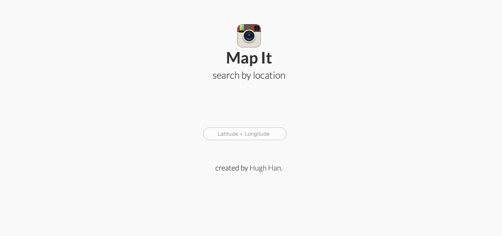

# Map It! #

Map It! is a web application that allows a user to enter any location, and displays a collection of the most popular recent media from Instagram associated with that location.

Map It! is being built using PHP and the Instagram API on the back end, and CSS and jQuery libraries on the front end.

### Interface ###

##### What's been done so far? #####

Map It! is still in development, but here are some examples of the user interface.

